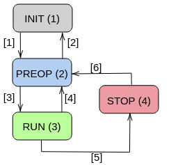

# Introduction

This repository contains the python driver to easily interact with the  [3D printed robotic actuator](https://github.com/ManuelSanchezMo/Robotic_actuator). 


# Finite State Machine


<p align="center">
  
</p>
##Dependencies

* can
* can_tools

## CAN Protocol

|Frame |Signal|Bit Position|Bit Length|Scale|Offset|Units|Notes                 |
|------|------|------------|----------|-----|------|-----|----------------------|
|0x001 |      |<ul><li>0</li><li>16</li><li>32</li></ul>|<ul><li>16</li><li>16</li><li>16</li></ul>|<ul><li>0.125</li><li>0.125</li><li>0.125</li></ul>|<ul><li>0</li><li>0</li><li>0</li></ul>|<ul><li>-</li><li>-</li><li>-</li></ul>|<ul><li>P value for the PID position control</li><li>I value for the PID position control</li><li>D value for the PID position control</li></ul>|
|0x002 |      |<ul><li>0</li><li>16</li><li>32</li><li>48</li></ul>|<ul><li>16</li><li>16</li><li>16</li><li>16</li></ul>|<ul><li>0.125</li><li>0.125</li><li>0.125</li><li>0.125</li></ul>|<ul><li>0</li><li>0</li><li>0</li><li>0</li><li></ul>|<ul><li>-</li><li>-</li><li>-</li><li>rad/s</li></ul>|<ul><li>P value for the PID speed control</li><li>I value for the PID speed control</li><li>D value for the PID speed control</li><li>Speed limit</li></ul>|
0x003 |      |<ul><li>0</li><li>16</li><li>32</li><li>48</li></ul>|<ul><li>16</li><li>16</li><li>16</li><li>16</li></ul>|<ul><li>0.125</li><li>0.125</li><li>1</li><li>0.125</li></ul>|<ul><li>0</li><li>0</li><li>0</li><li>-4095</li><li></ul>|<ul><li>V</li><li>V</li><li>-</li><li>rad</li></ul>|<ul><li>Voltage limit for motor input</li><li>Voltage limit for aling in calibration</li><li>Calibration (1 skip, o calibrate)</li><li>Electric angle offset </li></ul>|
0x004 |      |<ul><li>0</li><li>16</li><li>32</li><li>48</li></ul>|<ul><li>16</li><li>16</li><li>16</li><li>16</li></ul>|<ul><li>0.125</li><li>0.125</li><li>1</li><li>0.125</li></ul>|<ul><li>-4095</li><li>-4095</li><li>-4095</li><li>-4095</li><li></ul>|<ul><li>V</li><li>V</li><li>I</li><li>rad</li></ul>|<ul><li>Ua component of voltage input</li><li>Ub component of voltage input</li><li>Current drawn by motor</li><li>Electric angle  </li></ul>|
0x005 |      |<ul><li>0</li><li>16</li><li>32</li></ul>|<ul><li>16</li><li>16</li><li>16</li></ul>|<ul><li>0.125</li><li>0.125</li><li>0.125</li></ul>|<ul><li>-4095</li><li>-4095</li><li>-4095</li><li></ul>|<ul><li>rad</li><li>rad</li><li>rad/s</li></ul>|<ul><li>Current mechanical angle</li><li>Mechanical angle setponit</li><li>Shaft speed</li></ul>|
0x006 |      |<ul><li>0</li></ul>|<ul><li>16</li></ul>|<ul><li>1</li></ul>|<ul><li>0</li></ul>|<ul><li>-</li></ul>|<ul><li>Finite State Machine transition</li></ul>|
0x007 |      |<ul><li>0</li></ul>|<ul><li>16</li></ul>|<ul><li>0.125</li></ul>|<ul><li>-4095</li></ul>|<ul><li>rad</li></ul>|<ul><li>Motor set point command</li></ul>|

##USAGE EXAMPLE

```python
import motor_driver 
import numpy as np
if __name__ == '__main__':
    motor = motor_driver.motor_driver(cobid = 10, channel='can0') #Intantiate the python class
    motor.send_config_1(P_controller=1.0, I_controller=0.1,D_controller=0.0) # Configure position PID with config1 
    motor.send_config_2( P_vel = 2.0, I_vel = 0.01, D_vel = 0, Vel_lim  = 20.0) # Configure velocity PID and max vel with config2 
    motor.send_config_3( Volt_lim = 20.0, V_aling = 7.0, Calibrate = 0, Zero_angle_elec  = 0.0) # Configure max volts and calinration params with config3 
    motor.send_transition(1) #Transition to preop
    motor.send_transition(3) #Transition to run
    x = np.linspace(1, 10, num=10)
    y = np.sin(x)
    for n in range(y.size):
        print(n)
        motor.send_command(y[n]) #send angle commands
        print(motor.motor_mec_out) #monitor mechanical state
        print(motor.motor_elec_out) #monitor electrical state
    print('ended')
    motor.shutdown()


```